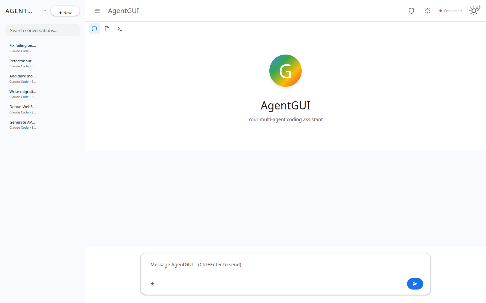
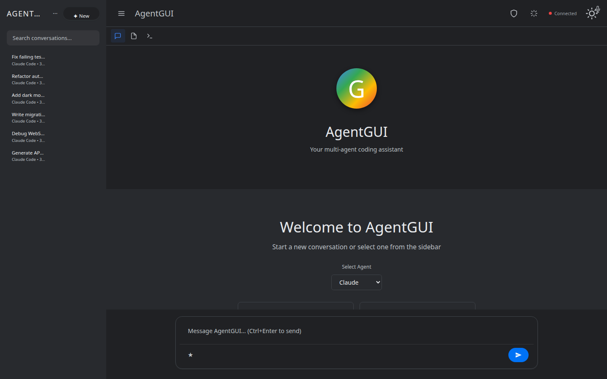
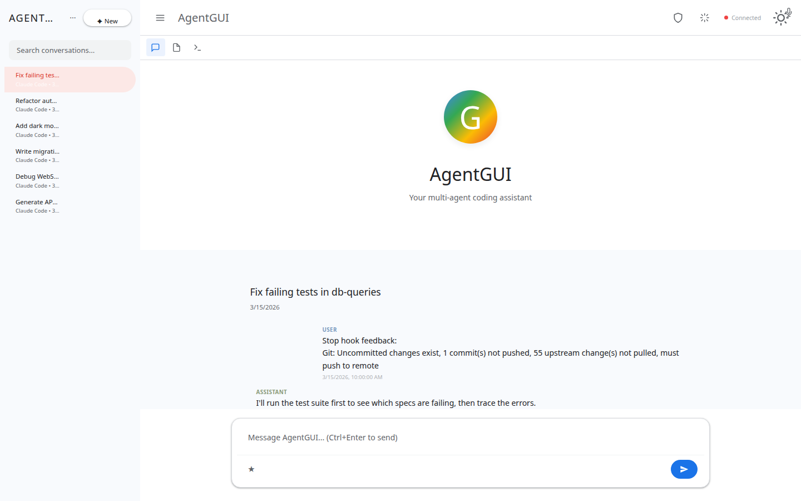
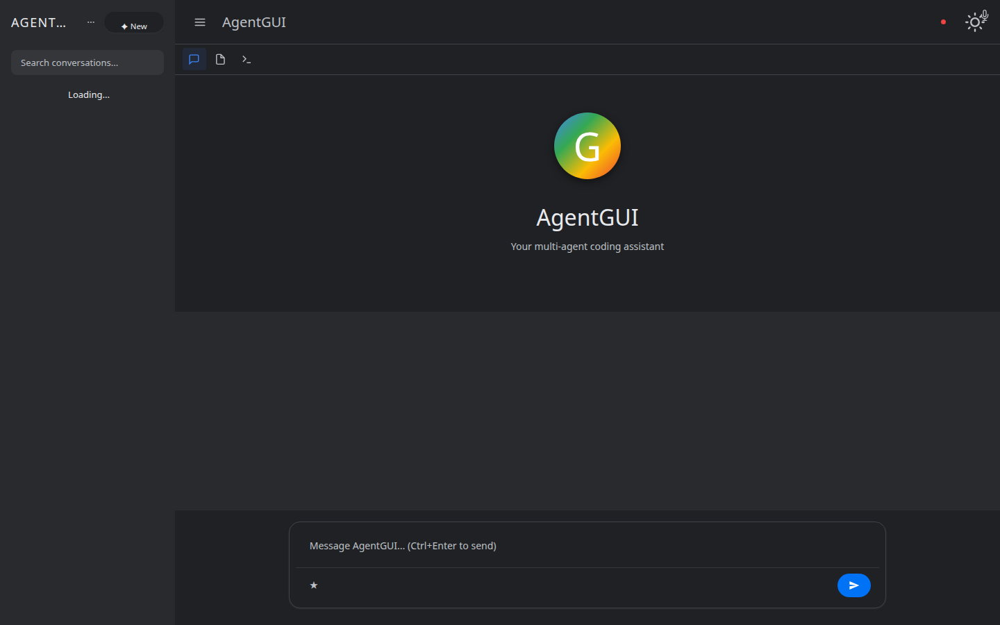

# AgentGUI

[](https://www.npmjs.com/package/agentgui)
[](https://www.npmjs.com/package/agentgui)
[](LICENSE)
[](https://anentrypoint.github.io/agentgui/)
[](https://github.com/AnEntrypoint/agentgui/stargazers)
[](https://github.com/AnEntrypoint/agentgui/commits)
[](https://github.com/AnEntrypoint/agentgui/releases)

Multi-agent GUI client for AI coding agents with real-time streaming, WebSocket sync, and SQLite persistence.

## How it works

AgentGUI is a single Node server (`server.js`) plus a same-origin browser client (`site/app/`). The server speaks ACP directly to local agent daemons (Claude Code, OpenCode, Kilo, Gemini CLI, etc.) via `@agentclientprotocol/sdk` and hosts `ccsniff`'s `/v1/history/*` Express router in-process for Claude Code JSONL session browsing — no external proxy required.

- UI: [anentrypoint-design](https://www.npmjs.com/package/anentrypoint-design) (CDN, single-file ESM)
- Server: `server.js` — ACP daemon manager + WebSocket chat + ccsniff history mount
- Source: `site/app/` (browser) + `lib/` (server)

History endpoints served by [`ccsniff`](https://github.com/AnEntrypoint/ccsniff) directly:

- `GET /v1/history/sessions` — list Claude Code sessions on the host
- `GET /v1/history/sessions/:sid/events` — flattened events for one session
- `GET /v1/history/search?q=…` — BM25-ranked search across all events
- `GET /v1/history/stream` — Server-Sent Events for live tailing

Chat streams over the `/sync` WebSocket using the `chat.sendMessage` method — see "WebSocket Chat Protocol" below.

### Supported Agents

| Agent | Protocol | Auto-installable |
|-------|----------|-----------------|
| Claude Code | CLI | - |
| OpenCode | ACP | `opencode-ai` |
| Gemini CLI | ACP | `@google/gemini-cli` |
| Kilo Code | ACP | `@kilocode/cli` |
| Goose | ACP | - |
| OpenHands | ACP | - |
| Augment Code | ACP | - |
| Cline | ACP | - |
| Kimi CLI | ACP | - |
| Qwen Code | ACP | - |
| Codex CLI | ACP | - |
| Mistral Vibe | ACP | - |
| Kiro CLI | ACP | - |
| fast-agent | ACP | - |



## Why AgentGUI?

Modern AI coding requires juggling multiple agents, each in their own terminal. AgentGUI solves this by providing a unified interface where you can:

- **Compare agents side-by-side** - Test the same prompt across Claude Code, Gemini CLI, OpenCode, and others
- **Preserve context** - Every conversation, file change, and terminal output is automatically saved
- **Resume interrupted work** - Pick up exactly where you left off, even after system restarts
- **Work visually** - See streaming responses, file changes, and tool calls in real-time instead of raw JSON

## Features

- 🤖 **Multi-Agent Support** - 14 agents: Claude Code, Gemini CLI, OpenCode, Kilo, Goose, OpenHands, Augment, Cline, Kimi, Qwen, Codex, Mistral Vibe, Kiro, fast-agent
- ⚡ **Real-Time Streaming** - Watch agents work with live streaming output and tool calls via WebSocket
- 💾 **Session Persistence** - Full conversation history stored in SQLite with WAL mode
- 🔄 **WebSocket Sync** - Live updates across multiple clients with automatic reconnection
- 🎤 **Voice Integration** - Speech-to-text and text-to-speech powered by Hugging Face Transformers (no API keys)
- 🛠️ **Tool Management** - Install and update agent plugins directly from the UI
- 📁 **File Browser** - Drag-and-drop uploads, direct file editing, and context-aware operations
- 🔌 **Developer Friendly** - Hot reload, REST API, WebSocket endpoints, and extensible plugin system

## GitHub Stats

| Metric | Badge |
|--------|-------|
| **Stars** | [](https://github.com/AnEntrypoint/agentgui/stargazers) |
| **Forks** | [](https://github.com/AnEntrypoint/agentgui/network/members) |
| **Watchers** | [](https://github.com/AnEntrypoint/agentgui/watchers) |
| **Open Issues** | [](https://github.com/AnEntrypoint/agentgui/issues) |
| **Activity** | [](https://github.com/AnEntrypoint/agentgui/commits) |

### Screenshots

| Light Mode | Dark Mode |
|------------|-----------|
|  |  |

| Active Conversation (light) | Active Conversation (dark) |
|-----------------------------|----------------------------|
|  |  |

| Tools Manager |
|---------------|
|  |

> Screenshots are regenerated on every push to `main` by `.github/workflows/gh-pages.yml` using the committed fixture DB (`fixtures/data.db`) so the gallery stays in sync with the UI.

## Quick Start

### Using npx (Recommended)

```bash
npx agentgui
```

### Manual Installation

```bash
git clone https://github.com/AnEntrypoint/agentgui.git
cd agentgui
npm install
npm run dev
```

Server starts on `http://localhost:3000/gm/`

## System Requirements

- Node.js 18+ (LTS recommended)
- SQLite 3
- Modern browser (Chrome, Firefox, Safari, Edge)
- At least one supported AI coding agent installed (see table above)

## Architecture

```
server.js              HTTP server + WebSocket + all API routes (raw http.createServer)
database.js            SQLite setup (WAL mode), schema, query functions
lib/claude-runner.js   Agent framework - AgentRunner/AgentRegistry classes
lib/acp-runner.js      ACP JSON-RPC session lifecycle
lib/acp-sdk-manager.js ACP tool lifecycle - auto-starts HTTP servers, health checks, restart
lib/ws-protocol.js     WebSocket RPC router (WsRouter class)
lib/ws-optimizer.js    Per-client priority queue for WS event batching
lib/ws-handlers-*.js   WebSocket RPC handlers (conv, msg, queue, session, run, util, oauth, scripts)
lib/speech.js          Speech-to-text and text-to-speech via @huggingface/transformers
lib/tool-manager.js    Tool detection, install, update facade
lib/plugins/           Server plugins (acp, agents, auth, database, files, git, speech, stream, tools, websocket, workflow)
static/index.html      Main HTML shell
static/app.js          App initialization
static/js/client.js    Main client logic
static/js/conversations.js       Conversation management
static/js/streaming-renderer.js  Renders agent streaming events as HTML
static/js/websocket-manager.js   WebSocket connection handling
static/js/*.machine.js           XState v5 state machines (ws, conv, tool-install, voice, conv-list, prompt)
```

### Key Details

- Agent discovery scans PATH for known CLI binaries at startup
- Database lives at `~/.gmgui/data.db` (WAL mode for concurrent access)
- WebSocket endpoint at `/gm/sync` for real-time updates
- ACP tools (OpenCode, Kilo) auto-launch as HTTP servers on startup with health checks

## Use Cases

**Multi-Agent Comparison**: Run the same task through different agents to compare approaches, quality, and speed.

**Long-Running Projects**: Build complex features across multiple sessions without losing context or conversation history.

**Team Collaboration**: Share conversation URLs and working directories for pair programming with AI agents.

**Agent Development**: Test and debug custom agents with full visibility into streaming events and tool calls.

**Offline Speech**: Use local speech-to-text and text-to-speech without API costs or internet dependency.

## REST API

All routes prefixed with `/gm`:

**Conversations:**
- `GET /api/conversations` - List conversations
- `POST /api/conversations` - Create conversation
- `GET /api/conversations/:id` - Get conversation with streaming status
- `POST /api/conversations/:id/messages` - Send message
- `DELETE /api/conversations/:id` - Delete conversation

**Agents & Tools:**
- `GET /api/agents` - List discovered agents
- `GET /api/tools` - List detected tools with installation status
- `POST /api/tools/:id/install` - Install tool
- `POST /api/tools/:id/update` - Update tool

**Speech:**
- `POST /api/stt` - Speech-to-text (raw audio input)
- `POST /api/tts` - Text-to-speech (returns audio)
- `GET /api/speech-status` - Check model download progress

**WebSocket:** `/gm/sync` - Subscribe to conversation/session updates with events like `streaming_start`, `streaming_progress`, `streaming_complete`

## Environment Variables

- `PORT` - Server port (default: 3000)
- `BASE_URL` - URL prefix (default: /gm)
- `STARTUP_CWD` - Working directory passed to agents
- `HOT_RELOAD` - Enable watch mode (default: true)
- `DEBUG` - Enable internal state inspection endpoints (set to `1`)

## Debug API

When `DEBUG=1` is set, internal state inspection endpoints become available:

**Endpoints:**
- `GET /api/debug/machines` - Inspect all XState v5 machine snapshots (execution, acp-server, tool-install states)
- `GET /api/debug/state` - Full server state dump (connections, queues, active sessions)
- `GET /api/debug/ws-stats` - WebSocket connection metrics and lag distribution

**Browser Console** (`window.__debug`):
- `window.__debug.machines` - All XState machines (conv, toolInstall, voice, convList, prompt, recording, terminal, ws)
- `window.__debug.ws` - WebSocket state, latency EMA, latency trend, URL
- `window.__debug.auth` - Agent auth and OAuth state
- `window.__debug.perf` - Conversation perf metrics
- `window.__debug.config` - Base URL and server config
- `window.__debug.renderer` - Streaming renderer event queue / history lengths
- `window.__debug.conv` - Current conversation and streaming set
- `window.__debug.getState()` - WS latency snapshot
- `window.__debug.getSyncState()` - Flat snapshot of all machines (legacy shape)
- `window.__debug.getMessageState()` - Message/queue DOM counts

See [CLAUDE.md](CLAUDE.md) for complete XState v5 machine documentation and internal architecture details.

## Troubleshooting

### Server Won't Start
- Check if port 3000 is in use: `lsof -i :3000` (macOS/Linux) or `netstat -ano | findstr :3000` (Windows)
- Try a different port: `PORT=4000 npm run dev`

### Agent Not Detected
- Verify agent is installed: `which claude` / `where claude`
- Check PATH includes agent binary location
- Restart server after installing new agents

### WebSocket Connection Failed
- Verify BASE_URL matches your deployment
- Check browser console for errors
- Ensure no firewall blocking WebSocket connections

### Speech Models Not Downloading
- Check internet connection and firewall
- Verify `~/.gmgui/models/` is writable
- Monitor progress via `/api/speech-status` endpoint

## Development

```bash
npm run dev        # Start with watch mode and hot reload
npm start          # Production mode (no watch)
npm test           # Run tests (if available)
```

Hot reload is enabled by default. File changes trigger automatic restart without losing state.

## Contributing

Contributions welcome! Please:

1. Fork the repository
2. Create a feature branch (`git checkout -b feature/amazing-feature`)
3. Commit your changes (`git commit -m 'Add amazing feature'`)
4. Push to the branch (`git push origin feature/amazing-feature`)
5. Open a Pull Request

## Links

- **GitHub:** https://github.com/AnEntrypoint/agentgui
- **npm:** https://www.npmjs.com/package/agentgui
- **Documentation:** https://anentrypoint.github.io/agentgui/
- **Issues:** https://github.com/AnEntrypoint/agentgui/issues

## License

MIT © [AnEntrypoint](https://github.com/AnEntrypoint)
